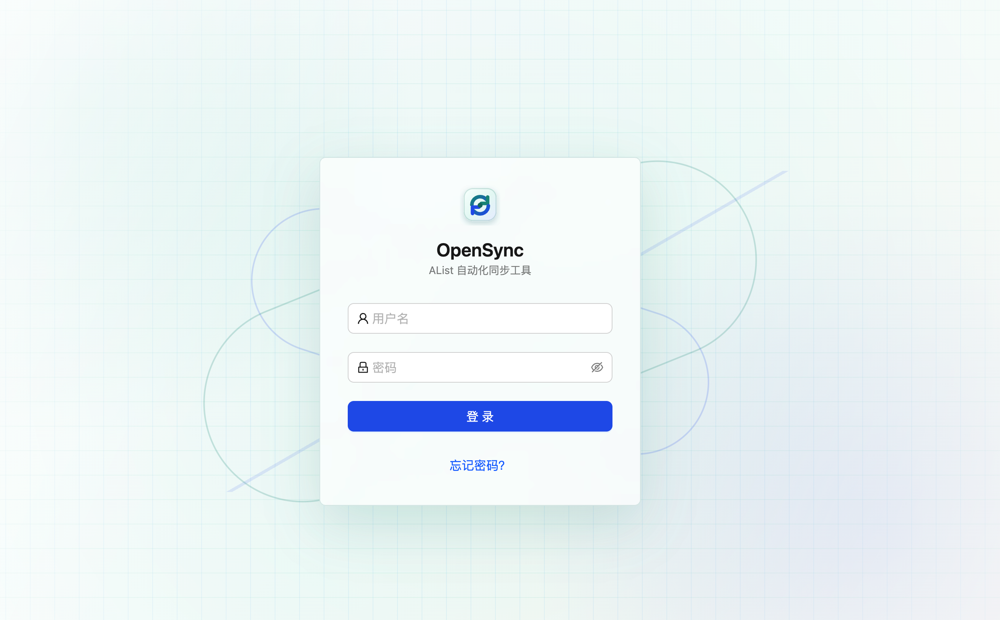
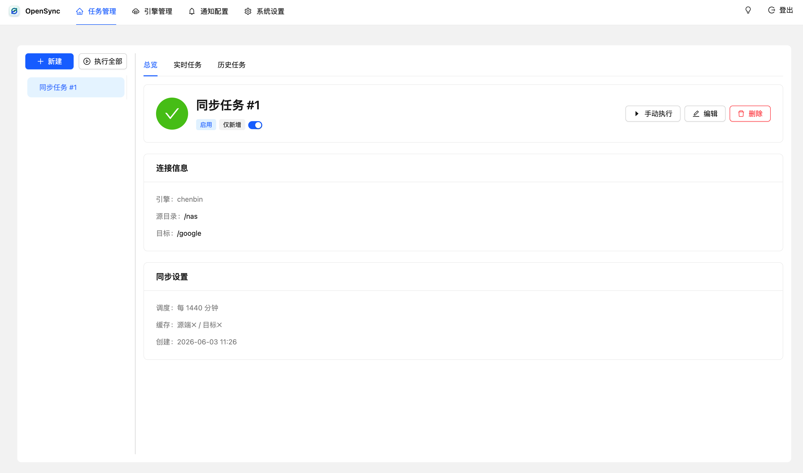
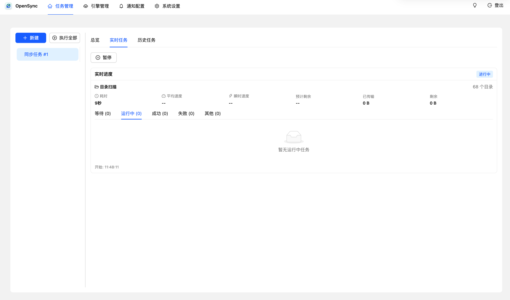
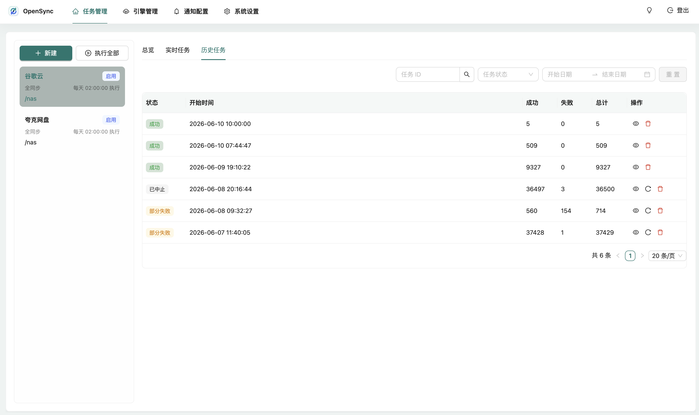
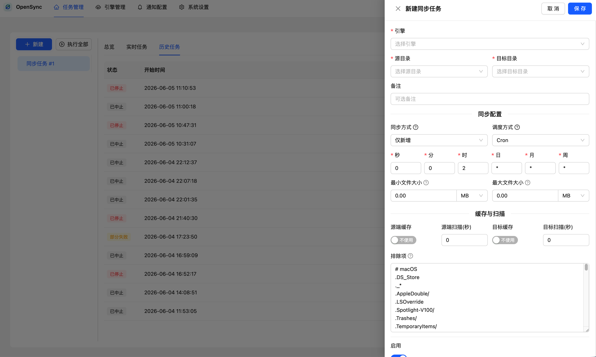
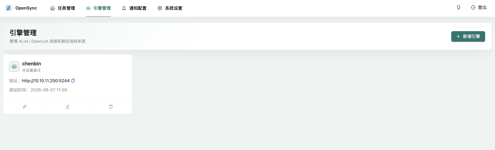
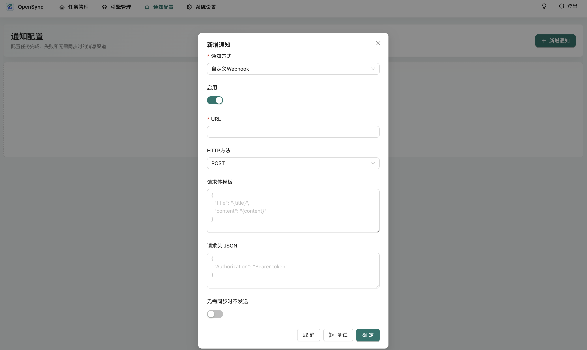
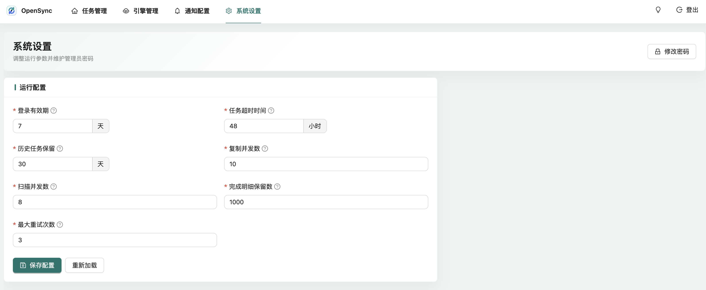

# OpenSync

OpenSync 是面向飞牛 fnOS / 飞牛 NAS 和 Docker 环境的 AList / OpenList 自动同步工具。它把本地目录、网盘、对象存储、WebDAV 等存储端统一接到 AList / OpenList 后，通过可视化任务完成自动备份、归档和迁移。

如果你在飞牛 NAS 上想找一个类似群晖 Cloud Sync 的同步工具，用来把照片库、影音库、下载目录或文档目录同步到网盘、对象存储或另一台存储设备，OpenSync 就是面向这个场景做的。

## 重点功能

- 支持单个或多个源目录同步到单个或多个目标目录。
- 支持仅新增、全同步和移动模式，适合备份、镜像同步和归档迁移。
- 支持手动执行、按分钟间隔执行、Cron 定时执行和一键执行全部启用任务。
- 支持 Gitignore 风格排除规则，以及最小/最大文件大小过滤。
- 实时展示扫描进度、传输速度、剩余时间、已完成、失败、等待和运行中明细。
- 历史任务支持查看详情、暂停、继续执行、重新执行、只重试失败项和删除记录。
- 支持多个 AList / OpenList 引擎，添加或更新时会验证连接，令牌不会在列表中展示。
- 支持自定义 Webhook、Server 酱、钉钉、企业微信、飞书 / Lark 通知。
- 自定义 Webhook 支持请求体模板和请求头 JSON。
- 支持“无需同步时不发送”通知。
- 支持登录、修改密码、忘记密码、深色模式、中英文和系统运行配置。

## 界面预览

### 登录



### 任务总览



### 实时任务



### 历史任务



### 新建和编辑任务



### 引擎管理



### 通知配置



### 系统设置



## 快速部署

推荐使用 Docker Compose 部署：

```bash
mkdir -p opensync
cd opensync
curl -O https://raw.githubusercontent.com/chenbin3625/OpenSync/main/docker-compose.yml
docker compose up -d
```

启动后访问：

```text
http://你的设备IP:8023/
```

首次启动时，初始管理员密码会打印在容器日志里：

```bash
docker logs opensync
```

默认配置会把运行数据保存到当前目录的 `data/` 文件夹。请保留这个目录，它包含数据库、密钥、配置和日志。

## docker-compose.yml

```yaml
services:
  opensync:
    image: chenbin3625/opensync:latest
    container_name: opensync
    restart: unless-stopped
    ports:
      - "8023:8023"
    volumes:
      - ./data:/app/data
    environment:
      OPENSYNC_PORT: 8023
      GIN_MODE: release
```

如需固定版本，可以把镜像改为：

```yaml
image: chenbin3625/opensync:1.5.0
```

## Docker 命令部署

```bash
docker run -d \
  --name opensync \
  --restart unless-stopped \
  -p 8023:8023 \
  -v opensync-data:/app/data \
  -e OPENSYNC_PORT=8023 \
  -e GIN_MODE=release \
  chenbin3625/opensync:latest
```

## 升级说明

1. 备份当前挂载的 `data/` 目录。
2. 拉取最新镜像或指定版本镜像。
3. 重新启动容器。
4. 首次启动会自动执行数据库迁移。

升级时不要删除 `data/secret.key`，否则旧登录 Cookie 和敏感信息加解密会失效。

## 配置

当 `data/config.ini` 不存在时，会读取环境变量：

| 变量 | 默认值 | 说明 |
| --- | --- | --- |
| `OPENSYNC_PORT` | `8023` | HTTP 服务端口 |
| `OPENSYNC_EXPIRES` | `7` | 登录有效期，单位天 |
| `OPENSYNC_LOG_LEVEL` | `1` | 文件日志等级 |
| `OPENSYNC_CONSOLE_LEVEL` | `2` | 控制台日志等级 |
| `OPENSYNC_LOG_SAVE` | `7` | 日志保留天数 |
| `OPENSYNC_TASK_SAVE` | `30` | 历史任务保留天数，`0` 表示保留全部 |
| `OPENSYNC_TASK_TIMEOUT` | `48` | 单次任务超时时间，单位小时，`0` 表示不限制 |
| `OPENSYNC_COPY_CONCURRENCY` | `5` | 单个任务的复制并发数，范围 `1` 到 `100` |
| `OPENSYNC_SCAN_CONCURRENCY` | `8` | 单个任务的扫描并发数，范围 `1` 到 `20` |
| `OPENSYNC_REALTIME_FINISHED_ITEMS` | `1000` | 实时任务页保留的已完成明细数量 |
| `OPENSYNC_MAX_RETRIES` | `0` | 单个复制项失败后的最大自动重试次数，`0` 表示不自动重试 |

如果需要使用配置文件，可以创建或通过系统设置页生成 `data/config.ini`：

```ini
[opensync]
port=8023
expires=7
log_level=1
console_level=2
log_save=7
task_save=30
task_timeout=48
copy_concurrency=5
scan_concurrency=8
realtime_finished_items=1000
max_retries=0
```

系统设置页可在线调整历史任务保留、任务超时、复制并发、扫描并发、实时明细保留和自动重试次数。端口、日志等级等启动期配置仍建议通过环境变量或配置文件维护。

## 本地构建镜像

```bash
docker build -t opensync .
docker run -d \
  --name opensync \
  --restart unless-stopped \
  -p 8023:8023 \
  -v opensync-data:/app/data \
  -e OPENSYNC_PORT=8023 \
  -e GIN_MODE=release \
  opensync
```

## 不使用 Docker 的生产构建

先构建前端，构建结果会写入 Go 的静态资源嵌入目录：

```bash
cd frontend
npm install
npm run build
```

再构建并运行后端：

```bash
cd ../backend
go build -o opensync ./cmd/server
./opensync
```

## 本地开发

启动后端：

```bash
cd backend
go run ./cmd/server
```

启动前端开发服务：

```bash
cd frontend
npm install
npm run dev
```

前端开发服务地址：

```text
http://127.0.0.1:3000/
```

开发服务会把 `/svr` 接口代理到：

```text
http://localhost:8023
```

## 开发检查

```bash
cd frontend
npm run build

cd ../backend
go test ./...
```

## Docker 镜像

OpenSync 默认推荐使用 Docker Hub 镜像：

- `chenbin3625/opensync:latest`
- `chenbin3625/opensync:1.5.0`
- `chenbin3625/opensync:1.5`

镜像支持以下平台：

- `linux/amd64`
- `linux/arm64`
- `linux/arm/v7`

适合常见 x86_64、ARM64 和 ARMv7 架构的飞牛系统、NAS 和服务器设备。

## GitHub Release 二进制产物

每个正式 Release 会同时上传免 Docker 的二进制压缩包，适合不方便使用容器的环境：

- `linux-amd64`
- `linux-arm64`
- `linux-armv7`
- `darwin-amd64`
- `darwin-arm64`
- `windows-amd64`
- `windows-arm64`

二进制文件已内嵌前端静态资源，解压后运行 `opensync` 或 `opensync.exe` 即可。运行数据仍会保存在程序工作目录下的 `data/` 目录，请和 Docker 部署一样保留该目录。

## 注意事项

- 不要提交或公开 `backend/data`、Docker 挂载的 `data/` 目录或任何包含 AList / OpenList Token 的文件。
- `data/secret.key` 会影响登录 Cookie 和敏感信息加解密，部署后应通过持久化目录保留。
- 如果误分享了运行数据目录，请及时更换 AList / OpenList Token。
- 升级前建议先备份 `data/` 目录。
