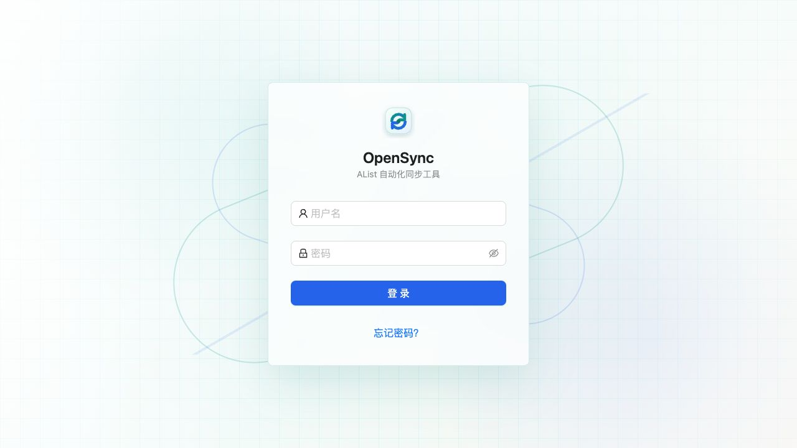
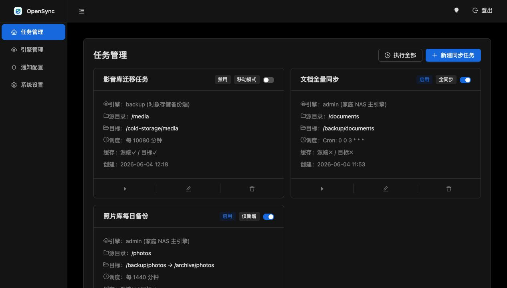
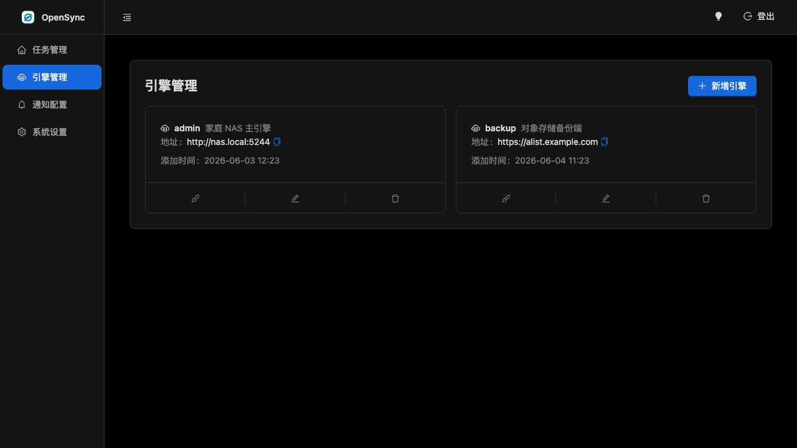
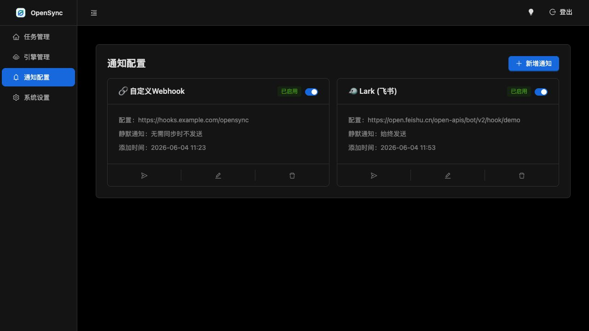
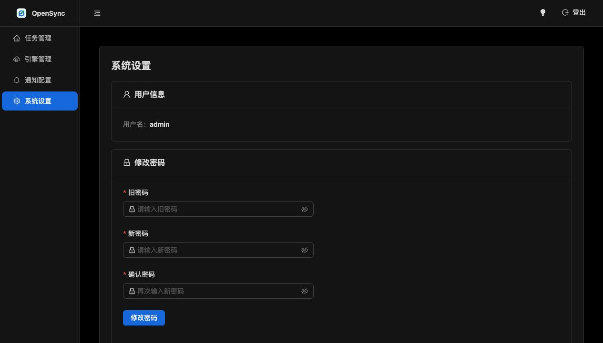

# OpenSync

OpenSync 是一个面向 AList 的自动化同步和备份工具，用来管理 AList 引擎、创建目录同步任务、查看同步进度，并在任务完成后发送通知。

它适合部署在飞牛系统（fnOS）、NAS、家庭服务器或普通 Docker 环境中。通过 AList 统一接入网盘、对象存储、WebDAV 等存储端后，OpenSync 可以按手动或定时策略执行目录同步，实现持续、可视化的自动化备份。

## 界面预览











## 适合场景

- 在飞牛系统下把本地目录自动备份到 AList 支持的远端存储
- 替代或补充群晖 Cloud Sync，做跨网盘、跨存储的自动同步
- 给家庭 NAS、影音库、照片库、文档目录配置定时备份
- 统一管理多个 AList 引擎和多条同步任务
- 查看每次同步的成功、失败、进度和错误原因
- 同步完成后通过 Webhook、Server 酱、钉钉、企业微信、飞书等渠道通知

## 功能

- 多 AList 引擎管理和连接测试
- 手动任务、间隔任务、Cron 任务
- 仅新增、全同步、移动模式
- 多目标路径同步
- 源目录和目标目录缓存控制
- 任务列表、执行历史、任务明细抽屉
- 实时进度、传输速度、文件数量、失败记录
- Webhook、Server 酱、钉钉、企业微信、飞书通知
- 登录、重置密码、修改密码、深色模式
- SQLite 本地数据存储
- Docker 和 Docker Compose 部署
- GitHub Release 自动构建 Docker 镜像

## Docker Compose 部署

推荐使用 Docker Compose 部署：

```bash
mkdir -p opensync
cd opensync
curl -O https://raw.githubusercontent.com/chenbin3625/OpenSync/main/docker-compose.yml
docker compose up -d
```

启动后访问：

```text
http://你的设备IP:8023/
```

首次启动时，初始管理员密码会打印在容器日志里：

```bash
docker logs opensync
```

默认配置会把运行数据保存到当前目录的 `data/` 文件夹。请保留这个目录，它包含数据库、密钥、语言设置和日志。

## docker-compose.yml

```yaml
services:
  opensync:
    image: ghcr.io/chenbin3625/opensync:latest
    container_name: opensync
    restart: unless-stopped
    ports:
      - "8023:8023"
    volumes:
      - ./data:/app/data
    environment:
      OPENSYNC_PORT: 8023
      GIN_MODE: release
```

## Docker 命令部署

```bash
docker run -d \
  --name opensync \
  --restart unless-stopped \
  -p 8023:8023 \
  -v opensync-data:/app/data \
  -e OPENSYNC_PORT=8023 \
  -e GIN_MODE=release \
  ghcr.io/chenbin3625/opensync:latest
```

## 本地构建镜像

```bash
docker build -t opensync .
docker run -d \
  --name opensync \
  --restart unless-stopped \
  -p 8023:8023 \
  -v opensync-data:/app/data \
  -e OPENSYNC_PORT=8023 \
  -e GIN_MODE=release \
  opensync
```

## 本地开发

启动后端：

```bash
cd backend
go run ./cmd/server
```

启动前端开发服务：

```bash
cd frontend
npm install
npm run dev
```

前端开发服务地址：

```text
http://127.0.0.1:3000/
```

开发服务会把 `/svr` 接口代理到：

```text
http://localhost:8023
```

## 不使用 Docker 的生产构建

先构建前端，构建结果会写入 Go 的静态资源嵌入目录：

```bash
cd frontend
npm install
npm run build
```

再构建并运行后端：

```bash
cd ../backend
go build -o opensync ./cmd/server
./opensync
```

## 配置

当 `data/config.ini` 不存在时，会读取环境变量：

| 变量 | 默认值 | 说明 |
| --- | --- | --- |
| `OPENSYNC_PORT` | `8023` | HTTP 服务端口 |
| `OPENSYNC_EXPIRES` | `2` | 登录有效期，单位天 |
| `OPENSYNC_LOG_LEVEL` | `1` | 文件日志等级 |
| `OPENSYNC_CONSOLE_LEVEL` | `2` | 控制台日志等级 |
| `OPENSYNC_LOG_SAVE` | `7` | 日志保留天数 |
| `OPENSYNC_TASK_SAVE` | `0` | 任务保留配置，`0` 表示保留全部 |
| `OPENSYNC_TASK_TIMEOUT` | `72` | 任务超时时间，单位小时 |

如果需要使用配置文件，可以创建 `data/config.ini`：

```ini
[opensync]
port=8023
expires=2
log_level=1
console_level=2
log_save=7
task_save=0
task_timeout=72
```

## 发布与 Docker 镜像

发布 GitHub Release 时，会自动构建并推送 Docker 镜像到 GitHub Container Registry。

例如发布 `v1.1.1` 后，会生成：

- `ghcr.io/chenbin3625/opensync:1.1.1`
- `ghcr.io/chenbin3625/opensync:1.1`
- `ghcr.io/chenbin3625/opensync:latest`
- `ghcr.io/chenbin3625/opensync:sha-<commit>`

当前自动发布的镜像平台为 `linux/amd64`，适合常见 x86_64 飞牛系统、群晖、NAS 和服务器设备。

## 开发检查

```bash
cd frontend
npm run build

cd ../backend
go test ./...
```

## 注意事项

- 不要提交或公开 `backend/data` 或 Docker 挂载的 `data` 目录。
- `secret.key` 会影响登录 Cookie 和敏感信息加解密，部署后应通过持久化目录保留。
- 如果误分享了运行数据目录，请及时更换 AList Token。
