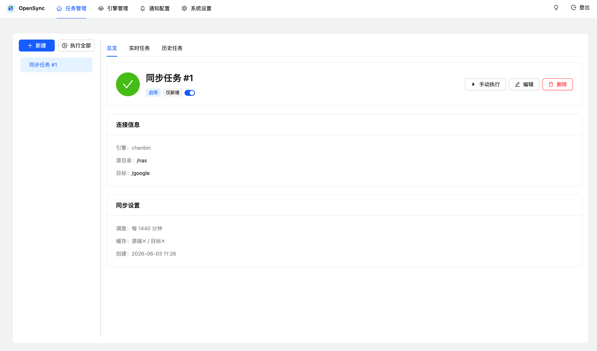
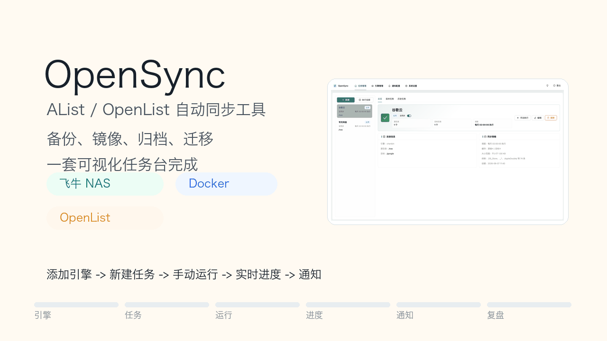
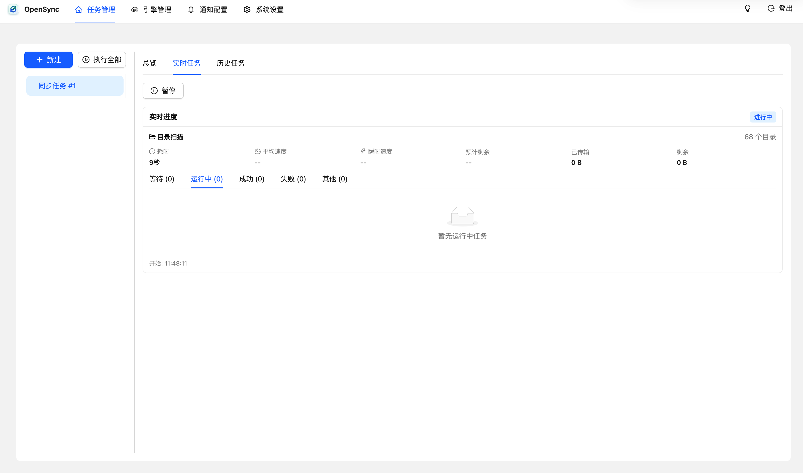
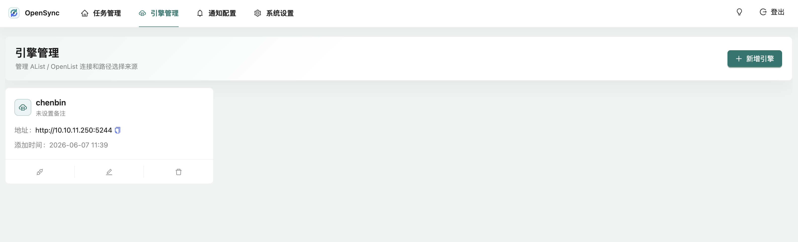
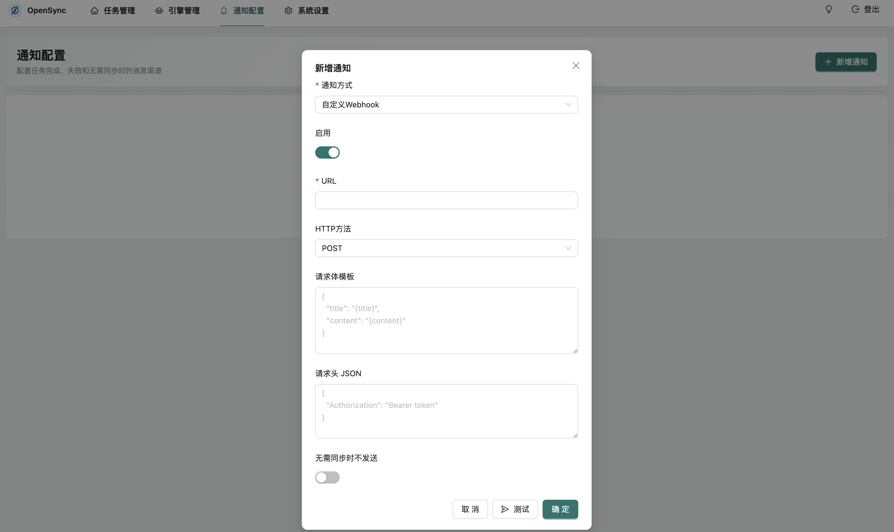
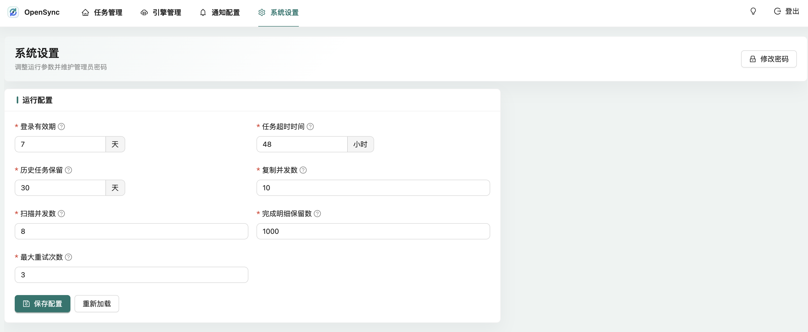

# OpenSync

[](LICENSE) [](https://github.com/chenbin3625/OpenSync/releases) [](https://github.com/chenbin3625/OpenSync/actions/workflows/ci.yml) [](https://hub.docker.com/r/chenbin3625/opensync)

[中文文档](README.zh-CN.md) | [60-second demo GIF](docs/demo/opensync-demo.gif) | [Docker Hub](https://hub.docker.com/r/chenbin3625/opensync) | [Discussions](https://github.com/chenbin3625/OpenSync/discussions)

OpenSync is an AList / OpenList automation layer for fnOS (FeiNiu NAS), general NAS, and Docker environments. It connects local folders, cloud drives, object storage, WebDAV, and other storage backends through AList / OpenList, then uses visual jobs to handle backup, mirror, archive, and migration workflows.

If you are on fnOS and want a Cloud Sync-style experience for a photo library, media library, download folder, or document folder, OpenSync is built for that exact gap.



## Why OpenSync

- You already use AList / OpenList to connect storage, but still need scheduled backup and migration jobs.
- You want to sync NAS folders to cloud drives, object storage, WebDAV, or another storage device without manual copying.
- You need visible progress, retryable failures, history records, and notifications instead of a black-box sync command.
- You want one Docker-friendly tool that works on x86_64, ARM64, and ARMv7 NAS devices.

## 60-second Demo

The demo walks through the main workflow: add an AList / OpenList engine, create a sync job, run it manually, watch realtime progress, and receive a notification.



## Quick Start

Docker Compose is recommended:

```bash
mkdir -p opensync
cd opensync
curl -O https://raw.githubusercontent.com/chenbin3625/OpenSync/main/docker-compose.yml
docker compose up -d
```

After startup, open:

```text
http://<your-device-ip>:8023/
```

On first start, open the web page and follow the prompts to create an admin username and password. When the account is created, a 24-digit recovery key is shown once. Save it immediately. If you forget the password, you can set a new one on the web page using "username + recovery key"; the old key becomes invalid and a new one is generated.

If the recovery key is also lost, log in to the server and run the CLI fallback reset:

```bash
./opensync reset-password --user admin
```

For Docker Compose deployments:

```bash
[ -f .env ] && . ./.env
docker compose exec --user "${PUID:-1000}:${PGID:-1000}" opensync ./opensync reset-password --user admin
```

## Typical Scenarios

| Scenario | Example |
| --- | --- |
| fnOS photo backup | Back up a local photo library to a cloud drive or object storage bucket. |
| Download archive | Move completed downloads to a WebDAV drive, another NAS, or a cold-storage folder. |
| Media library mirror | Mirror a media folder from one AList / OpenList backend to another. |
| Document protection | Run add-only backups for work documents and notify only when files changed. |
| Storage migration | Move or mirror files between different cloud drives exposed through AList / OpenList. |

## OpenSync vs Alternatives

| Capability | OpenSync | rclone | Synology Cloud Sync | AList / OpenList built-in copy |
| --- | --- | --- | --- | --- |
| Target users | fnOS, NAS, Docker, AList / OpenList users | CLI users and automation scripts | Synology users | AList / OpenList users |
| Visual job management | Yes | No, unless wrapped by another UI | Yes | Basic manual operations |
| AList / OpenList integration | First-class engine management | Via WebDAV or custom config | Not focused on AList / OpenList | Native, but not a scheduler |
| Multi-source / multi-target jobs | Yes | Scriptable | Limited by product | Manual |
| Add-only / full sync / move modes | Yes | Yes, via commands | Product-specific | Manual copy / move |
| Realtime per-file progress | Yes | CLI output / logs | Product UI | Limited |
| Retry unfinished items from history | Yes | Scriptable | Product-specific | No dedicated history retry |
| Notification channels | Webhook, ServerChan, DingTalk, WeCom, Feishu / Lark | Scriptable | Product-specific | No dedicated notification layer |
| Best fit | A visual Cloud Sync-style layer for AList / OpenList | Power users and scripts | Synology-only setups | Occasional manual file operations |

## Key Features

- Multiple sources and targets: sync one or more source directories to one or more target directories.
- Three sync modes: Add-only, Full sync, and Move for incremental backup, target mirroring, and archive/migration.
- Flexible scheduling: manual runs, minute-based intervals, Cron schedules, and one-click execution of all enabled jobs.
- Precise filtering: Gitignore-style exclusion rules and minimum/maximum file size filters.
- Realtime progress: scanned counts, transfer speed, remaining time, and per-file details for done, failed, waiting, and running files.
- Task management: stop running jobs; view details, retry unfinished items, and delete history records.
- Multiple engines: manage multiple AList / OpenList instances; addresses and tokens are validated before saving, and saved tokens are never echoed back.
- Notification channels: custom Webhook, ServerChan, DingTalk, WeCom, and Feishu / Lark; can stay silent when there is nothing to sync.
- Webhook customization: GET / POST / PUT, JSON body templates, custom headers, and test sending.
- Online runtime config: adjust history retention, task timeout, copy/scan concurrency, and auto-retry counts.
- Account recovery: a 24-digit recovery key is generated on first setup; supports web password reset and a `reset-password` CLI fallback.
- Adaptive UI: desktop and mobile layouts, a consistent light theme, and realtime updates when a task finishes.

## Interface Preview

### Task Management

Tasks are displayed as cards showing source, target, sync mode, and schedule, with live statistics and one-click run, stop, edit, or delete actions.


### Realtime Task

While a task is running, you can watch scanned file counts, transfer speed, remaining time, and the detail list of done, failed, waiting, and in-flight files.



### Task History

The history records the start time, duration, and result of every run, with options to view details, retry unfinished items, or delete records.


### Task Detail

The task detail page summarizes scan results and transfer statistics, and lets you inspect the sync status and errors of each file.


### Engine Management

Manage multiple AList / OpenList instances; addresses and tokens are validated when an engine is added, and saved tokens are never echoed back.



### Notifications

Supports custom Webhook, ServerChan, DingTalk, WeCom, and Feishu / Lark channels, with test messages available before saving.



### System Settings

Adjust history retention, task timeout, copy/scan concurrency, and auto-retry counts online, plus account and password management.



## Custom Webhook Notifications

When creating a notification on the config page, choose "Custom Webhook" to integrate an HTTP/HTTPS-callback messaging service or automation platform.

- `URL` is required and must be a valid HTTP or HTTPS webhook address; internal and loopback services are supported.
- `HTTP method` supports `GET`, `POST`, and `PUT`; defaults to `POST`.
- `GET` sends the notification title and content as `title` / `content` query parameters.
- `POST` / `PUT` send the body as `application/json` by default.
- `Body template` must be a JSON object supporting `{title}` and `{content}` placeholders; when empty, the default `{"title":"Notification title","content":"Notification content"}` is sent.
- `Header JSON` must be a JSON object, handy for auth headers such as `Authorization` and `X-Token`.
- When "Skip sending when nothing to sync" is enabled, no notification is sent when the task has nothing to sync.
- Click "Test" before saving to send a test message and confirm the target service can receive it.

Example body template:

```json
{
  "msg_type": "text",
  "text": {
    "title": "{title}",
    "content": "{content}"
  }
}
```

Example headers:

```json
{
  "Authorization": "Bearer your-token"
}
```

## Docker Compose

```yaml
services:
  opensync:
    image: chenbin3625/opensync:latest
    container_name: opensync
    restart: unless-stopped
    ports:
      - "8023:8023"
    volumes:
      - ./data:/app/data
    tmpfs:
      - /tmp:mode=1777
    environment:
      TZ: Asia/Shanghai
      PUID: ${PUID:-1000}
      PGID: ${PGID:-1000}
      SQLITE_TMPDIR: /tmp
      TMPDIR: /tmp
      OPENSYNC_BIND: 0.0.0.0
      OPENSYNC_PORT: 8023
      GIN_MODE: release
```

To pin a version, change the image to:

```yaml
image: chenbin3625/opensync:1.13.2
```

## Docker CLI Deployment

```bash
docker run -d \
  --name opensync \
  --restart unless-stopped \
  -p 8023:8023 \
  -v opensync-data:/app/data \
  --tmpfs /tmp:mode=1777 \
  -e TZ=Asia/Shanghai \
  -e SQLITE_TMPDIR=/tmp \
  -e TMPDIR=/tmp \
  -e OPENSYNC_BIND=0.0.0.0 \
  -e OPENSYNC_PORT=8023 \
  -e GIN_MODE=release \
  chenbin3625/opensync:latest
```

## Upgrading

1. Back up the mounted `data/` directory.
2. Pull the latest image or a pinned version.
3. Restart the container.
4. Database migrations run automatically on first start.

Do not delete `data/secret.key` when upgrading, otherwise old login cookies and the encryption of sensitive data will break. Web password reset only uses the recovery key and never asks for or exposes `data/secret.key`.

## Configuration

The timezone of scheduled tasks is always controlled by `TZ`; when `data/config.ini` does not exist, other startup settings are read from environment variables:

| Variable | Default | Description |
| --- | --- | --- |
| `TZ` | `Asia/Shanghai` | Timezone used by the container and scheduled tasks |
| `PUID` / `PGID` | `1000` / `1000` | Host user and group used by the container |
| `SQLITE_TMPDIR` / `TMPDIR` | `/tmp` | Temporary directory used by SQLite and runtime operations |
| `OPENSYNC_BIND` | `0.0.0.0` | HTTP listen address |
| `OPENSYNC_PORT` | `8023` | HTTP service port |
| `OPENSYNC_EXPIRES` | `7` | Login validity, in days |
| `OPENSYNC_LOG_LEVEL` | `1` | File log level |
| `OPENSYNC_CONSOLE_LEVEL` | `2` | Console log level |
| `OPENSYNC_LOG_SAVE` | `7` | Log retention days |
| `OPENSYNC_TASK_SAVE` | `30` | History retention days, `0` keeps all |
| `OPENSYNC_TASK_TIMEOUT` | `48` | Per-task timeout in hours, `0` means unlimited |
| `OPENSYNC_COPY_CONCURRENCY` | `5` | Copy concurrency per task, range `1` to `100` |
| `OPENSYNC_SCAN_CONCURRENCY` | `8` | Scan concurrency per task, range `1` to `20` |
| `OPENSYNC_MAX_RETRIES` | `2` | Max auto-retries after a copy item fails, `0` disables auto-retry |
| `OPENSYNC_TRUSTED_PROXIES` | empty | Comma-separated CIDR list of trusted reverse proxies |
| `OPENSYNC_CHOWN` | auto | Data directory ownership policy: `always`, `never`, or unset |

Ports: publish `8023` or whatever you set `OPENSYNC_PORT` to.

> Note: once `data/config.ini` exists, environment variables other than `OPENSYNC_TLS_CERT` / `OPENSYNC_TLS_KEY` no longer take effect after a restart; the config file wins. History retention, task timeout, copy/scan concurrency, and retry counts can also be adjusted online from the System Settings page.

## Data Persistence

Mount `/app/data`. It holds the database, secret key, config, and logs. Losing it means losing your account, engines, jobs, and history.

- Docker Compose uses `./data:/app/data`; the Docker CLI example uses the named volume `opensync-data:/app/data`.
- At container startup the ownership of `/app/data` is checked against `PUID` / `PGID` so no root-owned files appear in the host directory. Force a recursive chown with `OPENSYNC_CHOWN=always` or skip it with `OPENSYNC_CHOWN=never`.
- Do not delete `data/secret.key` when upgrading. It backs login cookies and the encryption of sensitive data. Web password reset only uses the recovery key and never exposes `secret.key`.
- Back up the mounted `data/` directory before upgrading. Database migrations run automatically on first start.
- Never expose the `data/` directory or any file containing AList / OpenList tokens; rotate your tokens if the runtime data directory was shared accidentally.

## Build the Image Locally

```bash
docker build -t opensync .
docker run -d \
  --name opensync \
  --restart unless-stopped \
  -p 8023:8023 \
  -v opensync-data:/app/data \
  --tmpfs /tmp:mode=1777 \
  -e TZ=Asia/Shanghai \
  -e OPENSYNC_PORT=8023 \
  -e GIN_MODE=release \
  opensync
```

## Production Build Without Docker

First build the frontend; the output is embedded into the Go static assets directory:

```bash
cd frontend
npm install
npm run build
```

Then build and run the backend:

```bash
cd ../backend
go build -o opensync ./cmd/server
./opensync
```

## Local Development

Start the backend:

```bash
cd backend
go run ./cmd/server
```

Start the frontend dev server:

```bash
cd frontend
npm install
npm run dev
```

Frontend dev server address:

```text
http://127.0.0.1:3000/
```

The dev server proxies `/svr` requests to:

```text
http://localhost:8023
```

## Development Checks

```bash
cd frontend
npm run build

cd ../backend
go test ./...
```

## Community

GitHub Discussions is open:

- `Q&A`: usage help and troubleshooting.
- `Ideas`: feature requests and roadmap ideas.
- `Show and tell`: deployment cases, screenshots, and NAS setups.

Please use GitHub Issues for reproducible bugs and Discussions for usage questions or deployment sharing.

## Security

Never commit or expose `backend/data`, a mounted `data/` directory, or any file containing AList / OpenList tokens. See [SECURITY.md](SECURITY.md) for vulnerability reporting and hardening notes.

## Contributing

Contributions are welcome. See [CONTRIBUTING.md](CONTRIBUTING.md) before opening a pull request.

## License

This project is released under the [MIT License](LICENSE).
