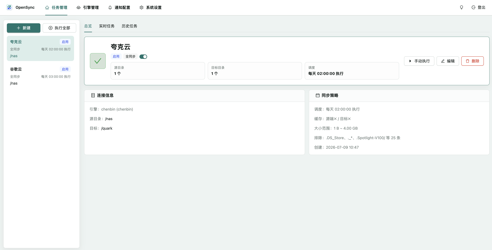
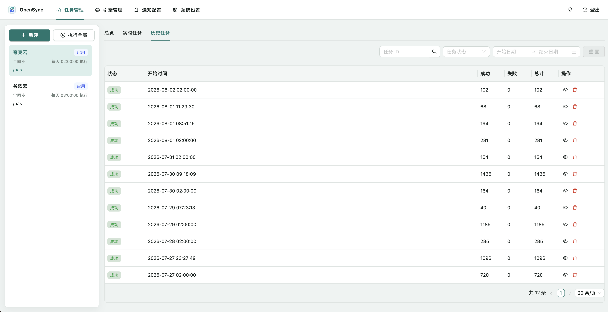
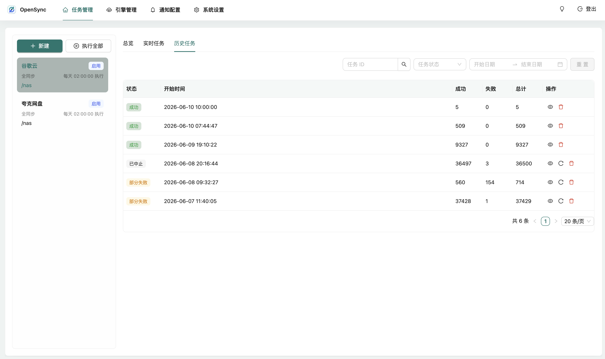
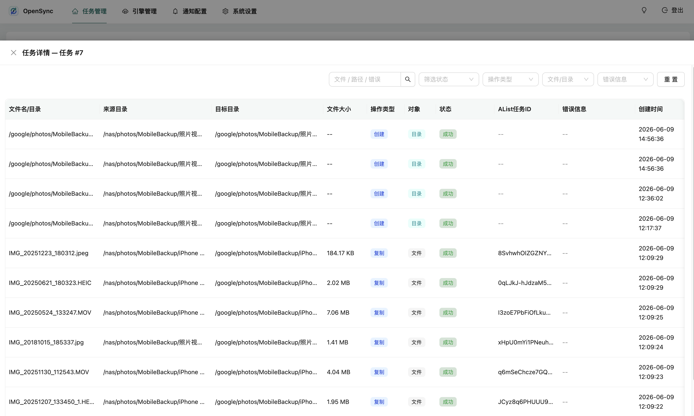
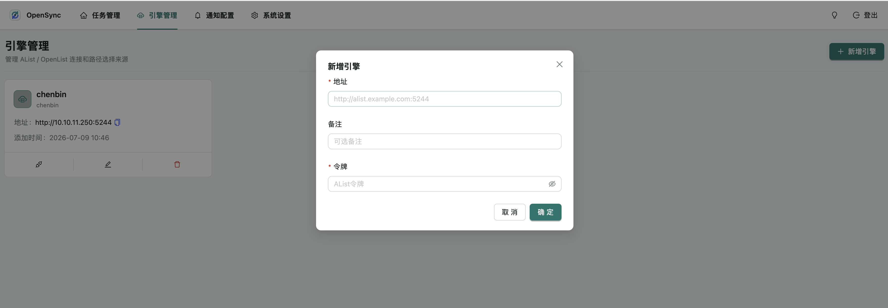
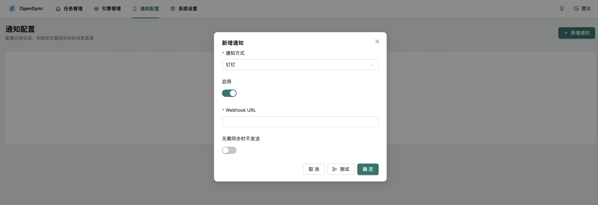
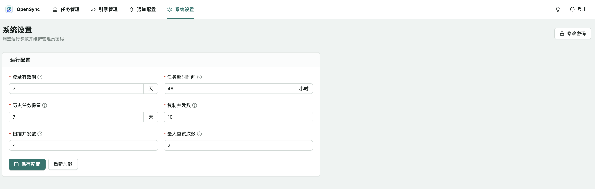

# OpenSync

OpenSync 是面向飞牛 fnOS / 飞牛 NAS、普通 NAS 和 Docker 环境的 AList / OpenList 自动同步工具。它通过 AList / OpenList 连接本地目录、网盘、对象存储、WebDAV 等存储端，并用可视化任务完成备份、镜像、归档和迁移。

如果你在飞牛 NAS 上想找一个类似群晖 Cloud Sync 的同步工具，用来把照片库、影音库、下载目录或文档目录同步到网盘、对象存储或另一台存储设备，OpenSync 就是面向这个场景做的。

## 重点功能

- 多源多目标：支持单个或多个源目录同步到单个或多个目标目录。
- 三种同步模式：仅新增、全同步和移动模式，分别适合增量备份、目标镜像和归档迁移。
- 灵活调度：支持手动执行、按分钟间隔执行、Cron 定时执行，以及一键执行全部已启用任务。
- 精确筛选：支持 Gitignore 风格排除规则和最小/最大文件大小过滤。
- 实时进度：展示扫描数量、传输速度、剩余时间，以及已完成、失败、等待和运行中的文件明细。
- 任务管理：运行中的任务可以停止；历史任务可以查看详情、重试未完成项和删除记录。
- 多引擎：可管理多个 AList / OpenList 实例，保存前验证地址和令牌，已保存令牌不会回显。
- 通知渠道：支持自定义 Webhook、Server 酱、钉钉、企业微信和飞书 / Lark；可设置无文件需要同步时静默。
- Webhook 定制：支持 GET / POST / PUT、JSON 请求体模板、自定义请求头和发送测试。
- 在线运行配置：可调整历史任务保留时间、任务超时、复制/扫描并发和失败自动重试次数。
- 账号恢复：首次初始化生成 24 位恢复密钥，支持网页重置密码和 `reset-password` CLI 兜底重置。
- 自适应界面：支持桌面端和移动端布局、浅色/深色主题，任务结束后实时视图会立即更新。

## 界面预览

### 任务管理

任务以卡片形式展示源目录、目标目录、同步模式与调度计划，可实时查看统计并一键执行、停止、编辑或删除。



### 实时任务

任务运行时可实时查看扫描文件数、传输速度、剩余时间，以及已完成、失败、等待和运行中的文件明细。



### 历史任务

历史任务记录每次执行的开始时间、耗时与结果，可查看详情、重试未完成项或删除记录。



### 任务详情

任务详情页汇总扫描结果与传输统计，并可逐条查看每个文件的同步状态与错误信息。



### 引擎管理

可维护多个 AList / OpenList 实例，添加引擎时自动验证地址与令牌，已保存令牌不会回显。



### 通知配置

支持自定义 Webhook、Server 酱、钉钉、企业微信和飞书 / Lark 等通知渠道，保存前可发送测试消息。



### 系统设置

在线调整历史任务保留时间、任务超时、复制/扫描并发与失败自动重试，并支持账号与密码管理。



## 自定义 Webhook 通知

在通知配置页新增通知时，选择“自定义Webhook”即可接入支持 HTTPS 回调的消息服务或自动化平台。

- `URL` 为必填项，必须填写有效的 HTTPS Webhook 地址。
- `HTTP方法` 支持 `GET`、`POST`、`PUT`，默认使用 `POST`。
- `GET` 会把通知标题和内容作为 `title`、`content` 查询参数发送。
- `POST` / `PUT` 默认以 `application/json` 发送请求体。
- `请求体模板` 可选，必须是 JSON 对象，支持 `{title}` 和 `{content}` 占位符；留空时默认发送 `{"title":"通知标题","content":"通知内容"}`。
- `请求头 JSON` 可选，必须是 JSON 对象，适合填写 `Authorization`、`X-Token` 等鉴权头。
- 打开“无需同步时不发送”后，当任务没有需要同步的内容时不会发送通知。
- 保存前可以点击“测试”发送测试消息，确认目标服务能够正常接收。

示例请求体模板：

```json
{
  "msg_type": "text",
  "text": {
    "title": "{title}",
    "content": "{content}"
  }
}
```

示例请求头：

```json
{
  "Authorization": "Bearer your-token"
}
```

## 快速部署

推荐使用 Docker Compose 部署：

```bash
mkdir -p opensync
cd opensync
curl -O https://raw.githubusercontent.com/chenbin3625/OpenSync/main/docker-compose.yml
docker compose up -d
```

启动后访问：

```text
http://你的设备IP:8023/
```

首次启动后，打开 Web 页面按提示创建管理员用户名和密码。创建完成时页面会一次性展示 24 位恢复密钥，请立即保存；忘记密码时可用“用户名 + 恢复密钥”在 Web 端设置新密码，成功后旧恢复密钥会失效并生成新的恢复密钥。

如果恢复密钥也丢失，需要登录服务器执行 CLI 兜底重置：

```bash
./opensync reset-password --user admin
```

Docker Compose 部署可执行：

```bash
[ -f .env ] && . ./.env
docker compose exec --user "${PUID:-1000}:${PGID:-1000}" opensync ./opensync reset-password --user admin
```

CLI 会打印新生成的密码和 24 位恢复密钥，请妥善保存；旧恢复密钥会随之失效。

默认配置会把运行数据保存到当前目录的 `data/` 文件夹。请保留这个目录，它包含数据库、密钥、配置和日志。

容器启动时会根据 `PUID` 和 `PGID` 检查 `/app/data` 的文件归属，并以该用户身份运行 OpenSync，避免宿主机 `data/` 目录生成 root 权限文件。默认 UID:GID 为 `1000:1000`；如需改成其他宿主机用户，可在 `.env` 中设置 `PUID` 和 `PGID`。目录所有者已经匹配时不会重复递归修改，可通过 `OPENSYNC_CHOWN=always` 强制执行，或通过 `OPENSYNC_CHOWN=never` 跳过修改。

## docker-compose.yml

```yaml
services:
  opensync:
    image: chenbin3625/opensync:latest
    container_name: opensync
    restart: unless-stopped
    ports:
      - "8023:8023"
    volumes:
      - ./data:/app/data
    environment:
      TZ: Asia/Shanghai
      PUID: ${PUID:-1000}
      PGID: ${PGID:-1000}
      OPENSYNC_BIND: 0.0.0.0
      OPENSYNC_PORT: 8023
      GIN_MODE: release
```

如需固定版本，可以把镜像改为：

```yaml
image: chenbin3625/opensync:1.10.6
```

## Docker 命令部署

```bash
docker run -d \
  --name opensync \
  --restart unless-stopped \
  -p 8023:8023 \
  -v opensync-data:/app/data \
  -e TZ=Asia/Shanghai \
  -e OPENSYNC_BIND=0.0.0.0 \
  -e OPENSYNC_PORT=8023 \
  -e GIN_MODE=release \
  chenbin3625/opensync:latest
```

## 升级说明

1. 备份当前挂载的 `data/` 目录。
2. 拉取最新镜像或指定版本镜像。
3. 重新启动容器。
4. 首次启动会自动执行数据库迁移。

升级时不要删除 `data/secret.key`，否则旧登录 Cookie 和敏感信息加解密会失效。Web 端密码重置只使用恢复密钥，不会要求输入或暴露 `data/secret.key`。

## 配置

定时任务时区始终由 `TZ` 控制；当 `data/config.ini` 不存在时，其它启动配置会读取环境变量：

| 变量 | 默认值 | 说明 |
| --- | --- | --- |
| `TZ` | `Asia/Shanghai` | 容器和定时任务使用的时区 |
| `OPENSYNC_BIND` | `0.0.0.0` | HTTP 监听地址 |
| `OPENSYNC_PORT` | `8023` | HTTP 服务端口 |
| `OPENSYNC_EXPIRES` | `7` | 登录有效期，单位天 |
| `OPENSYNC_LOG_LEVEL` | `1` | 文件日志等级 |
| `OPENSYNC_CONSOLE_LEVEL` | `2` | 控制台日志等级 |
| `OPENSYNC_LOG_SAVE` | `7` | 日志保留天数 |
| `OPENSYNC_TASK_SAVE` | `30` | 历史任务保留天数，`0` 表示保留全部；过期记录会在保存配置、服务启动和每日凌晨 3:00 自动清理 |
| `OPENSYNC_TASK_TIMEOUT` | `48` | 单次任务超时时间，单位小时，`0` 表示不限制 |
| `OPENSYNC_COPY_CONCURRENCY` | `5` | 单个任务的复制并发数，范围 `1` 到 `100` |
| `OPENSYNC_SCAN_CONCURRENCY` | `8` | 单个任务的扫描并发数，范围 `1` 到 `20` |
| `OPENSYNC_MAX_RETRIES` | `2` | 单个复制项失败后的最大自动重试次数，`0` 表示不自动重试 |
| `OPENSYNC_CHOWN` | 自动 | 容器数据目录权限策略：`always` 强制递归修改，`never` 跳过，未设置时仅在目录所有者不匹配时修改 |

如果需要使用配置文件，可以创建或通过系统设置页生成 `data/config.ini`：

```ini
[opensync]
bind=0.0.0.0
port=8023
expires=7
log_level=1
console_level=2
log_save=7
task_save=30
task_timeout=48
copy_concurrency=5
scan_concurrency=8
max_retries=2
```

系统设置页可在线调整历史任务保留、任务超时、复制并发、扫描并发和自动重试次数。历史任务会在保存配置时立即清理过期记录，并在每日凌晨 3:00 按保留天数再次清理。端口、日志等级等启动期配置仍建议通过环境变量或配置文件维护。

## 本地构建镜像

```bash
docker build -t opensync .
docker run -d \
  --name opensync \
  --restart unless-stopped \
  -p 8023:8023 \
  -v opensync-data:/app/data \
  -e TZ=Asia/Shanghai \
  -e OPENSYNC_PORT=8023 \
  -e GIN_MODE=release \
  opensync
```

## 不使用 Docker 的生产构建

先构建前端，构建结果会写入 Go 的静态资源嵌入目录：

```bash
cd frontend
npm install
npm run build
```

再构建并运行后端：

```bash
cd ../backend
go build -o opensync ./cmd/server
./opensync
```

## 本地开发

启动后端：

```bash
cd backend
go run ./cmd/server
```

启动前端开发服务：

```bash
cd frontend
npm install
npm run dev
```

前端开发服务地址：

```text
http://127.0.0.1:3000/
```

开发服务会把 `/svr` 接口代理到：

```text
http://localhost:8023
```

## 开发检查

```bash
cd frontend
npm run build

cd ../backend
go test ./...
```

## Docker 镜像

OpenSync 默认推荐使用 Docker Hub 镜像：

- `chenbin3625/opensync:latest`
- `chenbin3625/opensync:1.10.6`
- `chenbin3625/opensync:1.10`

镜像支持以下平台：

- `linux/amd64`
- `linux/arm64`
- `linux/arm/v7`

适合常见 x86_64、ARM64 和 ARMv7 架构的飞牛系统、NAS 和服务器设备。

## GitHub Release 二进制产物

每个正式 Release 会同时上传免 Docker 的二进制压缩包，适合不方便使用容器的环境：

- `linux-amd64`
- `linux-arm64`
- `linux-armv7`
- `darwin-amd64`
- `darwin-arm64`
- `windows-amd64`
- `windows-arm64`

二进制文件已内嵌前端静态资源，解压后运行 `opensync` 或 `opensync.exe` 即可。运行数据仍会保存在程序工作目录下的 `data/` 目录，请和 Docker 部署一样保留该目录。

## 注意事项

- 不要提交或公开 `backend/data`、Docker 挂载的 `data/` 目录或任何包含 AList / OpenList Token 的文件。
- `data/secret.key` 会影响登录 Cookie 和敏感信息加解密，部署后应通过持久化目录保留；它不用于 Web 端密码重置。
- 如果误分享了运行数据目录，请及时更换 AList / OpenList Token。
- 升级前建议先备份 `data/` 目录。

---

# English

OpenSync is an AList / OpenList automation tool for fnOS (FeiNiu NAS), general NAS, and Docker environments. It connects local folders, cloud drives, object storage, WebDAV, and other storage backends through AList / OpenList, and uses visual jobs to handle backup, mirror, archive, and migration workflows.

If you are on fnOS and looking for a Cloud Sync alternative to sync your photo library, media library, download folder, or document folder to a cloud drive, object storage, or another storage device, OpenSync is built for exactly that scenario.

## Key Features

- Multiple sources and targets: sync one or more source directories to one or more target directories.
- Three sync modes: Add-only, Full sync, and Move — suited for incremental backup, target mirroring, and archive/migration respectively.
- Flexible scheduling: manual runs, minute-based intervals, Cron schedules, and one-click execution of all enabled jobs.
- Precise filtering: Gitignore-style exclusion rules and minimum/maximum file size filters.
- Realtime progress: shows scanned counts, transfer speed, remaining time, and per-file details for done, failed, waiting, and running files.
- Task management: stop running jobs; view details, retry unfinished items, and delete history records.
- Multiple engines: manage multiple AList / OpenList instances; addresses and tokens are validated before saving, and saved tokens are never echoed back.
- Notification channels: custom Webhook, Server酱, DingTalk, WeCom, and Feishu / Lark; can stay silent when there is nothing to sync.
- Webhook customization: GET / POST / PUT, JSON body templates, custom headers, and test sending.
- Online runtime config: adjust history retention, task timeout, copy/scan concurrency, and auto-retry counts.
- Account recovery: a 24-digit recovery key is generated on first setup; supports web password reset and a `reset-password` CLI fallback.
- Adaptive UI: desktop and mobile layouts, light/dark themes, and the realtime view updates immediately when a task finishes.

## Interface Preview

### Task Management

Tasks are displayed as cards showing source, target, sync mode, and schedule, with live statistics and one-click run, stop, edit, or delete actions.


### Realtime Task

While a task is running, you can watch scanned file counts, transfer speed, remaining time, and the detail list of done, failed, waiting, and in-flight files.


### Task History

The history records the start time, duration, and result of every run, with options to view details, retry unfinished items, or delete records.


### Task Detail

The task detail page summarizes scan results and transfer statistics, and lets you inspect the sync status and errors of each file.


### Engine Management

Manage multiple AList / OpenList instances; addresses and tokens are validated when an engine is added, and saved tokens are never echoed back.


### Notifications

Supports custom Webhook, Server酱, DingTalk, WeCom, and Feishu / Lark channels, with test messages available before saving.


### System Settings

Adjust history retention, task timeout, copy/scan concurrency, and auto-retry counts online, plus account and password management.


## Custom Webhook Notifications

When creating a notification on the config page, choose "Custom Webhook" to integrate an HTTPS-callback messaging service or automation platform.

- `URL` is required and must be a valid HTTPS webhook address.
- `HTTP method` supports `GET`, `POST`, and `PUT`; defaults to `POST`.
- `GET` sends the notification title and content as `title` / `content` query parameters.
- `POST` / `PUT` send the body as `application/json` by default.
- `Body template` (optional) must be a JSON object supporting `{title}` and `{content}` placeholders; when empty, the default `{"title":"通知标题","content":"通知内容"}` is sent.
- `Header JSON` (optional) must be a JSON object, handy for auth headers such as `Authorization` and `X-Token`.
- When "Skip sending when nothing to sync" is enabled, no notification is sent when the task has nothing to sync.
- Click "Test" before saving to send a test message and confirm the target service can receive it.

Example body template:

```json
{
  "msg_type": "text",
  "text": {
    "title": "{title}",
    "content": "{content}"
  }
}
```

Example headers:

```json
{
  "Authorization": "Bearer your-token"
}
```

## Quick Start

Docker Compose is recommended:

```bash
mkdir -p opensync
cd opensync
curl -O https://raw.githubusercontent.com/chenbin3625/OpenSync/main/docker-compose.yml
docker compose up -d
```

After startup, open:

```text
http://<your-device-ip>:8023/
```

On first start, open the web page and follow the prompts to create an admin username and password. When the account is created, a 24-digit recovery key is shown once — save it immediately. If you forget the password, you can set a new one on the web page using "username + recovery key"; the old key becomes invalid and a new one is generated.

If the recovery key is also lost, log in to the server and run the CLI fallback reset:

```bash
./opensync reset-password --user admin
```

For Docker Compose deployments:

```bash
[ -f .env ] && . ./.env
docker compose exec --user "${PUID:-1000}:${PGID:-1000}" opensync ./opensync reset-password --user admin
```

By default, runtime data is stored in the `data/` folder of the current directory. Keep this directory — it contains the database, secret key, config, and logs.

At container startup, the ownership of `/app/data` is checked against `PUID` / `PGID`, and OpenSync runs as that user so that no root-owned files appear in the host `data/` directory. The default UID:GID is `1000:1000`; to use another host user, set `PUID` and `PGID` in `.env`. When the owner already matches, no recursive chown is performed; force it with `OPENSYNC_CHOWN=always` or skip it with `OPENSYNC_CHOWN=never`.

## docker-compose.yml

```yaml
services:
  opensync:
    image: chenbin3625/opensync:latest
    container_name: opensync
    restart: unless-stopped
    ports:
      - "8023:8023"
    volumes:
      - ./data:/app/data
    environment:
      TZ: Asia/Shanghai
      PUID: ${PUID:-1000}
      PGID: ${PGID:-1000}
      OPENSYNC_BIND: 0.0.0.0
      OPENSYNC_PORT: 8023
      GIN_MODE: release
```

To pin a version, change the image to:

```yaml
image: chenbin3625/opensync:1.10.6
```

## Docker CLI Deployment

```bash
docker run -d \
  --name opensync \
  --restart unless-stopped \
  -p 8023:8023 \
  -v opensync-data:/app/data \
  -e TZ=Asia/Shanghai \
  -e OPENSYNC_BIND=0.0.0.0 \
  -e OPENSYNC_PORT=8023 \
  -e GIN_MODE=release \
  chenbin3625/opensync:latest
```

## Upgrading

1. Back up the mounted `data/` directory.
2. Pull the latest image or a pinned version.
3. Restart the container.
4. Database migrations run automatically on first start.

Do not delete `data/secret.key` when upgrading, otherwise old login cookies and the encryption of sensitive data will break. Web password reset only uses the recovery key and never asks for or exposes `data/secret.key`.

## Configuration

The timezone of scheduled tasks is always controlled by `TZ`; when `data/config.ini` does not exist, other startup settings are read from environment variables:

| Variable | Default | Description |
| --- | --- | --- |
| `TZ` | `Asia/Shanghai` | Timezone used by the container and scheduled tasks |
| `OPENSYNC_BIND` | `0.0.0.0` | HTTP listen address |
| `OPENSYNC_PORT` | `8023` | HTTP service port |
| `OPENSYNC_EXPIRES` | `7` | Login validity, in days |
| `OPENSYNC_LOG_LEVEL` | `1` | File log level |
| `OPENSYNC_CONSOLE_LEVEL` | `2` | Console log level |
| `OPENSYNC_LOG_SAVE` | `7` | Log retention days |
| `OPENSYNC_TASK_SAVE` | `30` | History retention days, `0` keeps all; expired records are cleaned on config save, service start, and daily at 3:00 AM |
| `OPENSYNC_TASK_TIMEOUT` | `48` | Per-task timeout in hours, `0` means unlimited |
| `OPENSYNC_COPY_CONCURRENCY` | `5` | Copy concurrency per task, range `1` to `100` |
| `OPENSYNC_SCAN_CONCURRENCY` | `8` | Scan concurrency per task, range `1` to `20` |
| `OPENSYNC_MAX_RETRIES` | `2` | Max auto-retries after a copy item fails, `0` disables auto-retry |
| `OPENSYNC_CHOWN` | auto | Data directory ownership policy: `always` forces a recursive chown, `never` skips it; unset only chowns when the owner does not match |

To use a config file, create one or generate it from the System Settings page:

```ini
[opensync]
bind=0.0.0.0
port=8023
expires=7
log_level=1
console_level=2
log_save=7
task_save=30
task_timeout=48
copy_concurrency=5
scan_concurrency=8
max_retries=2
```

The System Settings page can adjust history retention, task timeout, copy concurrency, scan concurrency, and auto-retry counts online. Expired history records are cleaned immediately when settings are saved and again daily at 3:00 AM based on the retention days. Startup-time settings such as port and log level are still best maintained via environment variables or the config file.

## Build the Image Locally

```bash
docker build -t opensync .
docker run -d \
  --name opensync \
  --restart unless-stopped \
  -p 8023:8023 \
  -v opensync-data:/app/data \
  -e TZ=Asia/Shanghai \
  -e OPENSYNC_PORT=8023 \
  -e GIN_MODE=release \
  opensync
```

## Production Build Without Docker

First build the frontend; the output is embedded into the Go static assets directory:

```bash
cd frontend
npm install
npm run build
```

Then build and run the backend:

```bash
cd ../backend
go build -o opensync ./cmd/server
./opensync
```

## Local Development

Start the backend:

```bash
cd backend
go run ./cmd/server
```

Start the frontend dev server:

```bash
cd frontend
npm install
npm run dev
```

Frontend dev server address:

```text
http://127.0.0.1:3000/
```

The dev server proxies `/svr` requests to:

```text
http://localhost:8023
```

## Development Checks

```bash
cd frontend
npm run build

cd ../backend
go test ./...
```

## Docker Images

OpenSync recommends the Docker Hub images by default:

- `chenbin3625/opensync:latest`
- `chenbin3625/opensync:1.10.6`
- `chenbin3625/opensync:1.10`

Supported platforms:

- `linux/amd64`
- `linux/arm64`
- `linux/arm/v7`

Suitable for common x86_64, ARM64, and ARMv7 fnOS, NAS, and server devices.

## GitHub Release Binaries

Every official release also ships Docker-free binary archives for environments where containers are inconvenient:

- `linux-amd64`
- `linux-arm64`
- `linux-armv7`
- `darwin-amd64`
- `darwin-arm64`
- `windows-amd64`
- `windows-arm64`

The binaries embed the frontend static assets. After extracting, run `opensync` (or `opensync.exe`). Runtime data is still stored in the `data/` directory under the working directory, so keep it just like the Docker deployment.

## Notes

- Never commit or expose `backend/data`, a mounted `data/` directory, or any file containing AList / OpenList tokens.
- `data/secret.key` affects login cookies and the encryption of sensitive data; keep it via a persistent volume after deployment. It is not used for web password reset.
- If you have accidentally shared the runtime data directory, rotate your AList / OpenList tokens.
- Back up the `data/` directory before upgrading.
